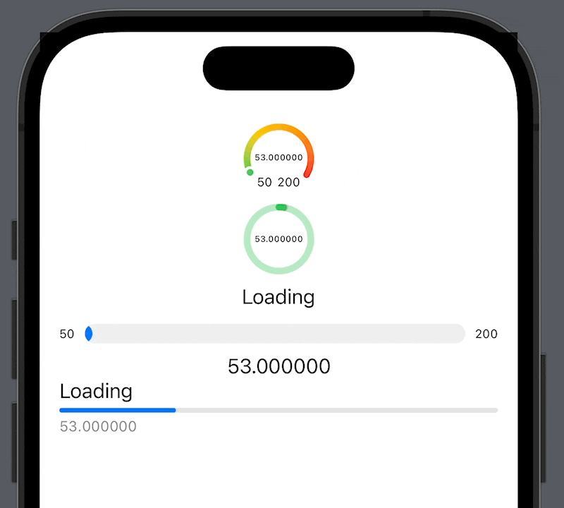

# New in SwiftUI: Gauge View

This is a code from the YT video "New in SwiftUI: Gauge View" 🤗

You will learn about the new Gauge in SwiftUI. It will help you present your progress data more easily. Enjoy 🤓

## Links:
- [Link to the video](https://www.youtube.com/watch?v=zdwSp1zMBwU)
- [Gauge](https://developer.apple.com/documentation/swiftui/gauge)